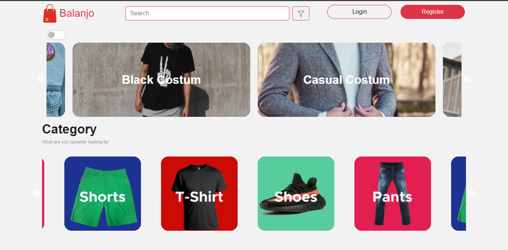
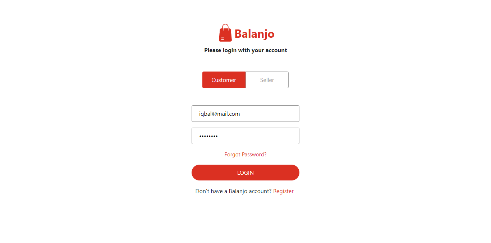
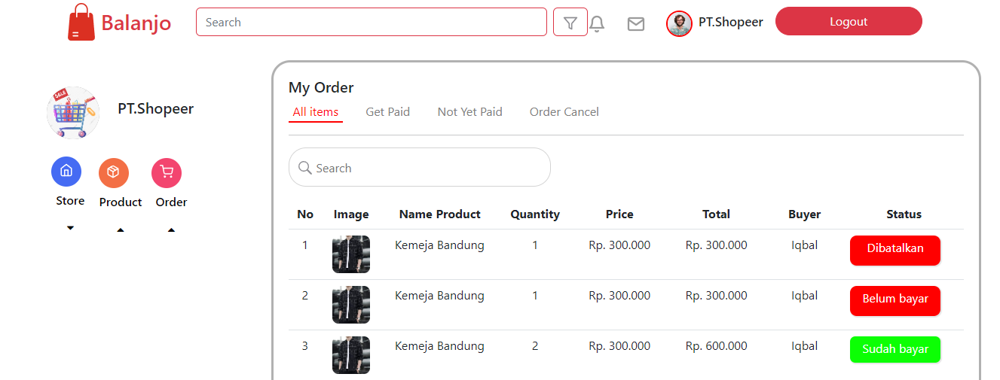
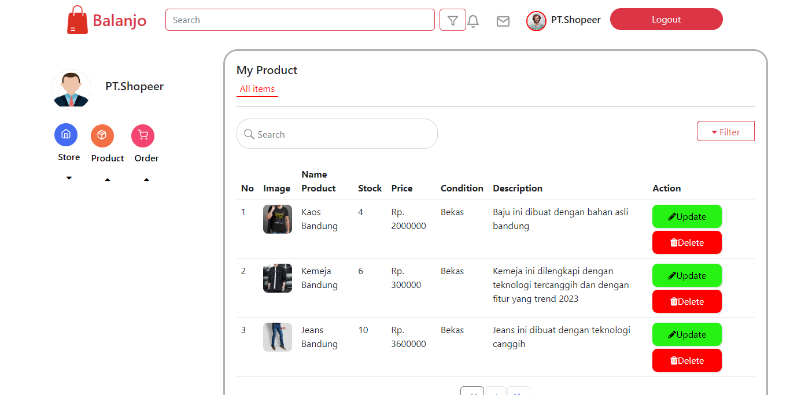

<br />
<p align="center">
<div align="center">
  
</div>
  <h3 align="center">Balanjo App</h3>
  <p align="center">
    <a href="https://github.com/preedok/FE-BALANJO/"><strong>Explore the docs »</strong></a>
    <br />
    <a href="/">View Demo</a>
    ·
    <a href="/">Report Bug</a>
    ·
    <a href="/">Request Feature</a>
  </p>
</p>


<!-- TABLE OF CONTENTS -->
## Table of Contents

- [Table of Contents](#table-of-contents)
- [About The Project](#about-the-project)
  - [Built With](#built-with)
- [Getting Started](#getting-started)
  - [Prerequisites](#prerequisites)
  - [Installation](#installation)
  - [Setup .env](#setup-env)
- [Screenshots](#screenshots)
- [Contributing](#contributing)
- [Related Project](#related-project)
- [Contact](#contact)


<!-- ABOUT THE PROJECT -->
## About The Project

Blanja API is a RESTful API used in Blanja Aplication. This API handle user management (customer & seller), get lists of products, product detail, and order operation (mybag, checkout, & myorder).

### Built With

- [Bootstrap Css](https://getbootstrap.com/)
- [React Js](https://reactjs.org/)
- and other


<!-- GETTING STARTED -->
## Getting Started

### Prerequisites

This is an example of how to list things you need to use the software and how to install them.

* [nodejs](https://nodejs.org/en/download/)

### Installation

- Clone This Front End Repo
```
git clone https://github.com/preedok/FE-BALANJO/.git
```
- Go To Folder Repo
```
cd FE-Balanjo
```
- Install Module
```
npm install
```
- <a href="#setup-env">Setup .env</a>
- Type ` npm run dev` To Start Website
- Type ` npm run production` To Start Production

### Setup .env
Create .env file in your root project folder.
```
REACT_BACKEND_API_URL = [BACKEND_URL]
```

<!-- ROADMAP -->
## Screenshots

<table>
 <tr>
    <td></td>
    <td> </td>
  </tr>
   <tr>
    <td>Landing Page</td>
    <td>Login</td>
  </tr>

  <tr>
    <td> </td>
     <td></td>
  </tr>
   <tr>
    <td>Order Sellers</td>
     <td>Product Sellers</td>
  </tr>
  
 
</table>


<!-- CONTRIBUTING -->
## Contributing

Contributions are what make the open source community such an amazing place to be learn, inspire, and create. Any contributions you make are **greatly appreciated**.

1. Fork the Project
2. Create your Feature Branch (`git checkout -b feature/AmazingFeature`)
3. Commit your Changes (`git commit -m 'Add some AmazingFeature'`)
4. Push to the Branch (`git push origin feature/AmazingFeature`)
5. Open a Pull Request


## Related Project
:rocket: [`Backend Balanjo`](https://github.com/preedok/BE-BALANJO/)

:rocket: [`Frontend Balanjo`](https://github.com/preedok/FE-BALANJO/)

:rocket: [`Demo Balanjo`](/)

<!-- CONTACT -->
## Contact

My Email : iqbalapreedo@gmail.com

Project Link: [https://github.com/preedok/FE-Balanjo/](https://github.com/preedok/FE-Balanjo/)
